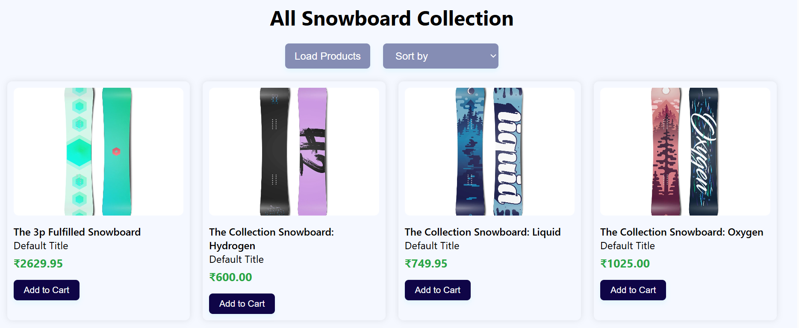
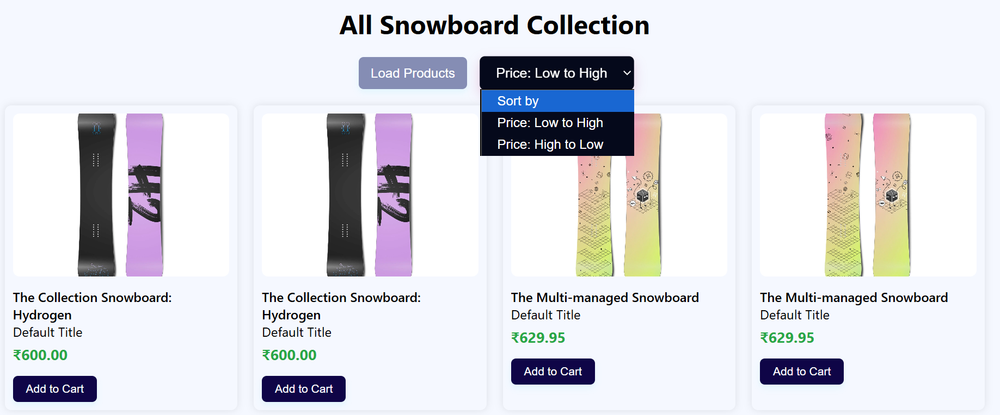
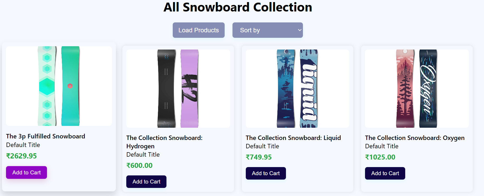

# 🏂 Snowboard Collection Page

A modern, animated, responsive E-Commerce front-end project that displays a collection of snowboards using live API data. Built with **HTML, CSS, and JavaScript**.

## 📸 Preview

## 🔗 Live Demo

[🌐 View Project Online](https://your-username.github.io/your-repo-name/)  

---

## 🚀 Features

- 📦 Fetches products from a live API
- ✨ Staggered animations for product cards
- 📱 Fully responsive layout (Mobile + Desktop)
- 🔍 Filter dropdown to sort products by price
- 🛒 "Add to Cart" button with hover animation
- 📄 Clean and modular code (HTML, CSS, JS)

---

## 🧑‍💻 Technologies Used

- **HTML5** – Markup structure
- **CSS3** – Styling & animations
- **JavaScript (ES6)** – API calls, DOM manipulation
- **API Endpoint** – [https://interveiw-mock-api.vercel.app/api/getProducts](https://interveiw-mock-api.vercel.app/api/getProducts)

---

## 📁 Project Structure

Snowboard-collection/
│
├── index.html # Main HTML file
├── style.css # All UI styling and animations
├── script.js # JS logic: fetch, render, sort, animate
├── screenshot.png # Screenshot for README
└── README.md # You're reading it